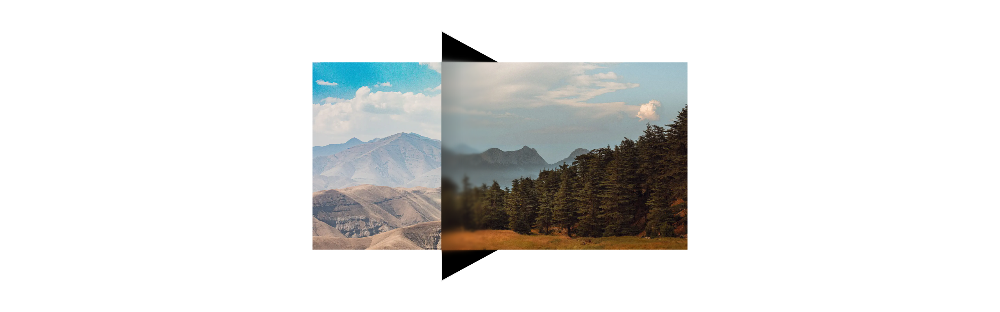

# Fold Carousel

A carousel that folds from one slide to the next, like a two-panel phone. The image stays flat and the frame changes shape around it with clipping, blur, and shading.

**[Examples and API →](https://fold-carousel.vercel.app)**

## Install

Needs a project set up with [shadcn](https://ui.shadcn.com/docs/installation).

```bash
npx shadcn@latest add Kareem-AEz/iphone-duo-fold-carousel/fold-carousel
```

This adds `components/ui/fold-carousel/` and installs `motion`, `lucide-react`, and `cn`.

## Usage

```tsx
import {
  FoldCarousel,
  FoldCarouselFrame,
  FoldCarouselNext,
  FoldCarouselPrevious,
} from "@/components/ui/fold-carousel/fold-carousel";

export function Gallery({ slides }: { slides: React.ReactNode[] }) {
  return (
    <FoldCarousel slides={slides} aria-label="Gallery">
      <FoldCarouselFrame variant="door" />
      <FoldCarouselPrevious />
      <FoldCarouselNext />
    </FoldCarousel>
  );
}
```

Slides can be any element that fills a box, like `img` or `next/image` with `fill`. The fold paints each slide 10 to 18 times, so it is built for images, not video or interactive content.

Tweak defaults, the door's leaf stagger, and the blur and shade ramps in `config.ts`.

## Credits

Demo photos from Pexels: [Elvin Muradzade](https://www.pexels.com/photo/34492458/), [Massih](https://www.pexels.com/photo/8177145/), [second897](https://www.pexels.com/photo/8557328/), [cottonbro studio](https://www.pexels.com/photo/9906684/).

## License

[MIT](./LICENSE)
